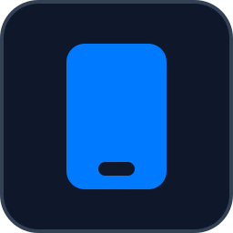
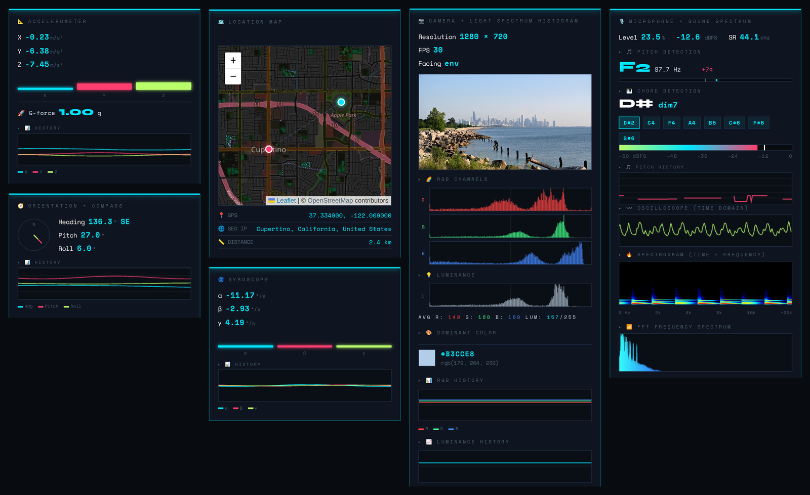
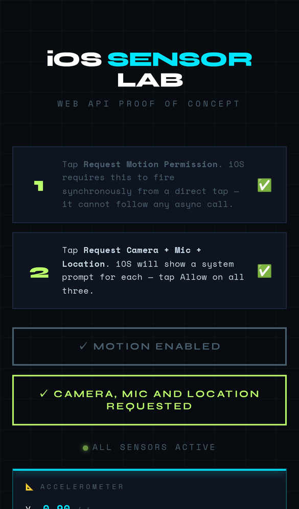

<p align="center">
  
</p>

# iOS Sensor Lab

<!-- BADGES:START -->


[](LICENSE.md)
[](CONTRIBUTING.md)
<!-- BADGES:END -->

## Table of Contents

- [Description](#description)
- [Screenshots](#screenshots)
- [Features](#features)
- [Requirements](#requirements)
- [Installation](#installation)
- [Usage](#usage)
- [Privacy](#privacy)
- [Deployment](#deployment)
- [Architecture](#architecture)
- [Credits](#credits)
- [Contributing](#contributing)
- [License](#license)

## Description

iOS Sensor Lab shows how much of a phone a web page can reach. Open it in
Safari on an iPhone, grant two permissions, and it reads the accelerometer,
gyroscope, compass, GPS, camera and microphone, and charts each one live, along
with what the browser reveals about the device and the network.

It began as a proof of concept for the permission rules iOS imposes on the web,
and it is a handy sensor dashboard. It is one HTML file with no build step,
using [Leaflet](https://leafletjs.com/) for the map. It runs live at
[ios-sensors.geoffmyers.com](https://ios-sensors.geoffmyers.com).

## Screenshots

<p align="center">
  
</p>

<p align="center">
  
</p>

<p align="center"><em>Captured in headless Chromium at iPhone size. A desktop browser has no motion sensors, so the motion and orientation readings are fed in by the capture script through the same events Safari fires. The camera is a still photo, the microphone plays synthesised piano chords, and the GPS and IP positions are set to Apple Park and Cupertino.</em></p>

## Features

| Card | What it shows |
|---|---|
| Accelerometer | X, Y and Z in m/s², bars, g-force and a history chart |
| Dead reckoning | Speed and distance estimated by summing acceleration over time, with a still-detection reset and a drift warning |
| Gyroscope | Rotation rates α, β, γ in °/s, with history |
| Orientation + compass | Heading with a compass needle and cardinal direction, pitch and roll, with history |
| Geolocation | Latitude, longitude, altitude and their accuracy, speed and heading |
| Location map | Your GPS position and your IP address's estimated position on a map, and the distance between them |
| Camera | Live preview, resolution, frame rate, RGB and luminance histograms, average and dominant colour, and their history |
| Microphone | Level, dBFS meter with peak, pitch with cents, chord name and notes, pitch history, oscilloscope, spectrogram and spectrum |
| Screen orientation | Portrait or landscape, and the angle |
| Visual viewport | Size, scale and offsets as the page is zoomed or the keyboard opens |
| Speech recognition | Live transcript, where the browser supports it |
| Network / IP | IP address, country, Cloudflare data centre, TLS and HTTP versions, WARP |
| Client / device | User agent, platform, languages, time zone, screen, colour depth, GPU, CPU cores, memory, JS heap, touch points, connection, online state, cookies, Do Not Track and Global Privacy Control |

## Requirements

- **iPhone or iPad with Safari on iOS 13 or later** for everything. Speech
  recognition needs iOS 14.5 or later.
- The page must be served over **HTTPS** (or from `localhost`): browsers only
  expose these sensors to secure pages.
- Desktop browsers work for the camera, microphone, geolocation and device
  cards, but have no motion sensors.
- The network card reads Cloudflare's `/cdn-cgi/trace`, so it only works when
  the site is served through Cloudflare.
- To deploy it as the author does: a Cloudflare account and
  [Wrangler](https://developers.cloudflare.com/workers/wrangler/) 4.

## Installation

```bash
git clone https://github.com/geoffmyers/ios-sensors.git
cd ios-sensors
python3 -m http.server 8000
```

Open <http://localhost:8000> on the same computer. To try it on a phone, the
page needs HTTPS: deploy it (see [Deployment](#deployment)), or put a local
HTTPS tunnel in front of the server.

## Usage

1. Tap **① Request Motion Permission**. iOS only shows its motion prompt in
   direct response to a tap, so this has to come first and on its own.
2. Tap **② Request Camera + Mic + Location** and allow each of the three
   prompts.
3. Scroll through the cards. Each lights up as its sensor starts; a card that
   cannot start says why.
4. In the dead-reckoning card, **Reset** zeroes the estimate. The warning that
   appears after ten seconds is real: summing noisy acceleration drifts quickly.
5. In the speech card, **Start** begins a transcript.

## Privacy

Sensor readings are processed in the page and are not sent anywhere. The page
does make three kinds of request that involve you:

- **ipapi.co** receives your IP address, to estimate the location shown on the
  map.
- **Map tiles** come from OpenStreetMap's tile servers, which see the area being
  viewed.
- **Speech recognition** is the browser's own service; Safari may send the
  audio to Apple to transcribe it.

## Deployment

The site is deployed as a [Cloudflare Worker with static
assets](https://developers.cloudflare.com/workers/static-assets/). The
repository root is the asset directory:

- `wrangler.toml` names the Worker and its custom domain. Both are the author's:
  change `name`, `account_id` and `routes` before deploying your own copy.
- `_headers` sets the Content-Security-Policy, which allows exactly the outside
  sources the page uses: Leaflet from unpkg, Google Fonts, OpenStreetMap tiles
  and ipapi.co. Wrangler 4 applies it; older versions uploaded it as a public
  file instead.
- `.assetsignore` keeps `wrangler.toml` and the repository docs from being
  served.

```bash
npx wrangler@4 deploy
```

## Architecture

Everything is in `index.html`: styles, the card markup, and one script. The
script starts each sensor from the permission buttons, and a
`requestAnimationFrame` loop redraws the charts from ring buffers the sensor
events fill.

| Path | Role |
|---|---|
| `index.html` | The whole app |
| `_headers` | Security headers, including the Content-Security-Policy |
| `wrangler.toml` | Cloudflare Worker name, custom domain and asset directory |
| `.assetsignore` | Files Wrangler must not publish |
| `docs/` | README icon and screenshots |

See [ARCHITECTURE.md](ARCHITECTURE.md) for how each card gets and processes its
data.

## Credits

- Map by [Leaflet](https://leafletjs.com/) (BSD-2-Clause), with tiles and data
  © [OpenStreetMap contributors](https://www.openstreetmap.org/copyright)
  (ODbL).
- IP geolocation by [ipapi.co](https://ipapi.co/).
- Set in [Syne](https://fonts.google.com/specimen/Syne) and
  [Space Mono](https://fonts.google.com/specimen/Space+Mono), served by Google
  Fonts under the SIL Open Font License.
- The camera in the screenshot sees
  [a photo of the Chicago skyline by DimiTalen](https://commons.wikimedia.org/wiki/File:Morning_view_of_the_downtown_skyline_from_near_Morgan_Point_along_Lakefront_Trail,_Chicago,_2025.jpg),
  released under CC0.
- The README icon is the [Font Awesome](https://fontawesome.com/) `mobile` glyph,
  as shown for this app on [geoffmyers.com](https://www.geoffmyers.com), used under
  [CC BY 4.0](https://creativecommons.org/licenses/by/4.0/).

Written by Geoff Myers ([geoffmyers.com](https://www.geoffmyers.com)).

## Contributing

Bug reports and pull requests are welcome. See [CONTRIBUTING.md](CONTRIBUTING.md)
for setup, checks and how this repository is published.

## License

Copyright © 2026 Geoff Myers

This program is free software: you can redistribute it and/or modify it under
the terms of the GNU General Public License as published by the Free Software
Foundation, either version 3 of the License, or (at your option) any later
version.

This program is distributed in the hope that it will be useful, but WITHOUT ANY
WARRANTY; without even the implied warranty of MERCHANTABILITY or FITNESS FOR A
PARTICULAR PURPOSE. See [LICENSE.md](LICENSE.md) for the full text of the GNU
General Public License.

SPDX-License-Identifier: `GPL-3.0-or-later`
